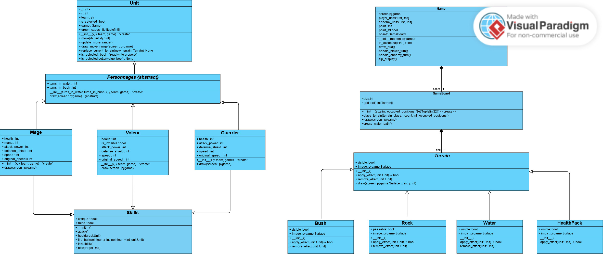

# Jeu_Python_2D

## Présentation du projet

Ce projet consiste à développer un jeu de stratégie 2D en Python en utilisant la bibliothèque **Pygame**. Le jeu est inspiré des jeux de stratégie tour par tour comme **Dofus** et se base sur l'univers du **Seigneur des Anneaux**. Il se joue en 1v1 contre une IA, où chaque camp contrôle ses unités tour par tour sur une grille.

### Fonctionnalités principales

* **Déplacement des unités** avec des vitesses et capacités différentes.
* **Compétences uniques à chaque personnage** comme 'heal', 'bow', 'fire ball', et 'invisibility'.
* **Gestion des terrains** comme les buissons, rochers, eau, et packs de soin.
* **Système de coup critique et coup manqué** pour rendre le combat plus stratégique.
* **Interface graphique immersive** avec sons et visuels tirés du Seigneur des Anneaux.

## Structure des classes

Le projet utilise une architecture POO bien définie avec des relations d'héritage, de composition et d'abstraction, comme représenté dans le diagramme de classes suivant :

###  Principales classes

* **Unit** : Classe de base pour toutes les unités avec des méthodes de mouvement.
* **Personnage (abstraite)** : Hérite de `Unit`, représente les personnages avec des capacités uniques.
* **Mage, Voleur, Guerrier** : Sous-classes de `Personnage`, avec des statistiques et compétences propres.
* **Terrain** : Classe de base pour tous les types de terrain (Buisson, Rocher, Eau, Pack de soin).
* **Game** : Contrôle la logique du jeu et l'interaction avec l'utilisateur.
* **Skills** : Gestion des compétences et des interactions de combat.

